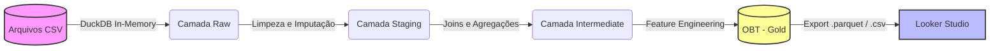

# Desafio Técnico: Engenharia de Analytics - Itaú

## 🎯 Objetivo do Projeto

Construir um pipeline analítico ponta a ponta para processar a base de dados do *Home Credit Default Risk*, estruturando, transformando e gerando uma camada analítica consolidada para modelagem de risco de crédito e geração de insights.

## 🛠️ Stack Tecnológica e Arquitetura

Para garantir reprodutibilidade, escalabilidade e velocidade sem a necessidade de infraestrutura complexa local, a seguinte stack foi utilizada:

  * **Ambiente e Orquestração:** Google Colab (Python).
  * **Motor de Processamento (OLAP):** DuckDB (Processamento in-memory em SQL otimizado para cargas analíticas).
  * **Visualização:** Looker Studio (Conectado via `.csv` exportado da base final).

    ### Fluxo de Dados (Data Flow)

### 🛡️ Decisões de Arquitetura (MVP)
* **Prevenção de Data Leakage:** A base do Kaggle (Home Credit) é fornecida como um *snapshot* ancorado no momento da aplicação. Todas as marcações temporais (como `DAYS_DECISION` e `DAYS_CREDIT`) representam dias relativos negativos ao pedido atual. Por design, não há eventos futuros vazando para o momento da predição, o que tornou redundante a criação de filtros de janela temporal (Point-in-Time) nas agregações históricas.
* **Tipagem e Schema (Medallion):** Para garantir a agilidade deste MVP analítico, optou-se pelo inferimento dinâmico de schema na ingestão (`read_csv_auto` do DuckDB) na camada Raw. A garantia de tipagem, tratamento de anomalias e coerção de nulos foi isolada e centralizada na camada Staging, simulando o comportamento de contratos de transformação de ferramentas como o dbt.
  
## 🏗️ Modelagem de Dados

O pipeline foi desenhado inspirado na arquitetura *Medallion*, progredindo de um Data Lake bruto para um Data Mart modelado.

1.  **Camada Raw:** Ingestão direta dos arquivos `.csv` via DuckDB (`read_csv_auto`), otimizando o uso de memória RAM no Colab.
2.  **Camada Staging:** Limpeza, padronização e feature engineering inicial na tabela fato principal (`application_train`).
3.  **Camada Intermediate:** Resolução de granularidade. Tabelas com histórico de múltiplas linhas por cliente (`bureau` e `previous_application`) foram agregadas (`GROUP BY`) para gerar variáveis sumarizadas de comportamento.
4.  **Camada Analítica (Gold / OBT):** \* **Decisão Arquitetural:** Embora a modelagem lógica siga um **Star Schema** (Fato: Applications | Dimensões: Bureau Summary, Previous History), a entrega física foi consolidada em uma **OBT (One Big Table)**.
      * **Justificativa:** Algoritmos de Machine Learning não consomem tabelas relacionais. Entregar uma OBT garante que o "Produto de Dados" esteja perfeitamente alinhado à necessidade do consumidor final (Cientistas de Dados), com todas as features prontas para o treino.

## ⚙️ Principais Transformações e Regras de Negócio

Durante o desenvolvimento, priorizei a qualidade dos dados e a geração de variáveis preditivas fortes:

  * **Foco MVP (Escopo):** Das 8 tabelas disponíveis, o pipeline focou nas 3 de maior poder preditivo (Application, Bureau e Previous Application) para otimizar o tempo de entrega e focar em lógicas complexas de agregação.
  * **Tratamento de Anomalias:** A coluna `DAYS_EMPLOYED` possuía \~18% da base com o valor `365243` (anomalia de sistema para não-aplicáveis/aposentados). Esse "magic number" foi convertido para `NULL` para evitar distorções graves em modelos de ML.
  * **Feature Engineering:** Criação de variáveis como `ANNUITY_INCOME_RATIO` (comprometimento de renda) e contagem de aprovações/recusas passadas.
  * **Tratamento de Clientes Novos:** Uso estratégico de `LEFT JOIN` seguido de `COALESCE` na construção da OBT para garantir que clientes sem histórico de crédito não fossem descartados, assumindo valor `0` para métricas de histórico.

    ### 🧠 Camada Semântica e Qualidade
* **Cross-Features:** Criação de variáveis preditivas compostas, como o `ANNUITY_INCOME_RATIO`, cruzando dados de anuidade e renda para determinar a capacidade real de pagamento.
* **Camada Semântica (DataViz):** A padronização de métricas (agregações de risco) e a tradução de regras de negócio em dimensões amigáveis (ex: faixas de atraso e faixas de comprometimento) foram isoladas na camada semântica do Looker Studio, garantindo que o usuário de negócios consuma conceitos padronizados.
* **Data Contracts (Qualidade):** Implementação de testes automatizados via SQL no final do pipeline para garantir expectativas críticas como unicidade da chave primária prevenindo *fan-out* nos joins e completude da variável resposta `TARGET`.

  ### ✅ Data Contracts (Testes de Qualidade)
Para garantir a integridade e a governança do pipeline antes de exportar a tabela analítica (OBT) para o Looker Studio, foram implementados testes de qualidade automatizados (`asserts`) no script final:

| Teste (Contrato) | Regra de Negócio | Validação (Lógica) |
| :--- | :--- | :--- |
| **Unicidade e Cardinalidade** | Garante que as agregações e os `JOINs` com as tabelas de histórico não geraram linhas duplicadas (fan-out) no nível do cliente. | `COUNT(*) == COUNT(DISTINCT SK_ID_CURR)` |
| **Domínio e Nulos (Target)** | Assegura que a variável resposta (que seria o alvo do modelo de ML) não possui valores nulos ou vazios gerados no processamento. | `SUM(CASE WHEN TARGET IS NULL THEN 1 ELSE 0) == 0` |
| **Range Lógico (Idades)** | Impede a passagem de anomalias temporais ou de sistema, garantindo que todos os clientes tenham idades humanamente possíveis. | `MIN(AGE_YEARS) >= 18` e `MAX(AGE_YEARS) <= 100` |
| **Integridade Matemática** | Valida as features derivadas, garantindo que não existam inconsistências lógicas ou divisões que resultem em números negativos. | `MIN(CREDIT_INCOME_RATIO) >= 0` |
    
## 📖 Dicionário de Features Derivadas (Engenharia de Variáveis)
Além das métricas básicas sugeridas, o pipeline focou na criação de variáveis preditivas de alto valor analítico baseadas no comportamento histórico e capacidade de pagamento:
    | Nome da Feature | Lógica (SQL) | Racional de Negócio (Descrição) |
| :--- | :--- | :--- |
| **`ANNUITY_INCOME_RATIO`** | `AMT_ANNUITY / AMT_INCOME_TOTAL` | **Comprometimento de Renda:** Mede o peso real da parcela no salário do cliente. É uma métrica de risco de crédito muito mais precisa do que apenas olhar para o valor total do empréstimo. |
| **`PREV_REFUSED_COUNT`** | `SUM(CASE WHEN status = 'Refused' THEN 1 ELSE 0)` *(na base previous_application)* | **Histórico de Recusas Internas:** Quantifica quantas vezes o próprio banco negou crédito ao cliente no passado. Mostrou-se um forte ofensor de inadimplência nas análises exploratórias. |
| **`BUREAU_AVG_OVERDUE_DAYS`** | `AVG(CREDIT_DAY_OVERDUE)` *(na base bureau)* | **Atraso Médio no Mercado:** Traduz o comportamento do cliente em outras instituições (Bureau/Serasa). Essa métrica contínua foi agrupada em faixas de safra no dashboard para facilitar a visualização do risco. |
| **`HAS_BUREAU_HISTORY`** | `CASE WHEN b.SK_ID_CURR IS NOT NULL THEN 1 ELSE 0 END` *(na OBT)* | **Flag de Desambiguação (Histórico Externo):** Diferencia clientes que são "bons pagadores" (0 dias de atraso comprovados) de clientes "fantasmas/desbancarizados" (sem histórico no mercado). Impede que modelos de ML tratem a ausência de dados como bom comportamento. |
| **`BUREAU_ACTIVE_LOANS`** | `SUM(CASE WHEN active = 'Active' THEN 1 ELSE 0)` *(na base bureau)* | **Empréstimos Ativos Externos:** Conta o número de linhas de crédito abertas simultaneamente no mercado, indicando possível alavancagem excessiva do cliente. |
| **`YEARS_EMPLOYED`** | `ABS(DAYS_EMPLOYED) / 365.25` *(com anomalias convertidas em NULL)* | **Tempo de Emprego (Anos):** Traduz a variável original (dias negativos) para uma escala humanamente legível, tratando o "magic number" de sistema (365243) para não distorcer o modelo. |

## 📊 Principais Insights (Raciocínio Analítico)

A exploração da Camada Analítica revelou padrões comportamentais claros:

1.  **O Peso do Histórico Interno:** Clientes com 3 ou mais recusas prévias no histórico interno apresentam quase o dobro de inadimplência (12.6%) em comparação aos que nunca tiveram crédito recusado (6.9%).
2.  **Paradoxo do Comprometimento de Renda:** A inadimplência sobe gradativamente conforme o cliente compromete mais sua renda com a parcela (atingindo 8.7% na faixa de 20-30%). Contudo, na faixa de extremo comprometimento (\>30%), o risco cai levemente para 8.1%. Isso sugere a atuação de uma esteira de aprovação manual/rígida mitigando o risco das operações mais críticas.
3.  **Foco no Resultado:** Working e Commercial Associate representam +de 70% da base e um risco de aproximadamente 9%. Alguns outliers apesar de identificados foram mantidos pois a representatividade de base era ínfima. Por exemplo, no campo de tipo de renda Maternity Leave possui 40% de risco, porém representa <1% da base.

## 🚀 Como Executar

1.  Clone este repositório.
2.  Acesse o notebook `case_itau_ea.ipynb` (link abaixo).
3.  Faça o upload dos arquivos `.csv` do Kaggle para o seu Google Drive.
4.  Ajuste a variável `caminho_base` no primeiro bloco de código para apontar para a sua pasta.
5.  Execute as células sequencialmente. O arquivo `obt_credit_risk_features.parquet` (e `.csv`) será gerado na última etapa.

## 🔗 Links Úteis

  * **[Dashboard Interativo (Looker Studio) - Insights de Inadimplência](https://lookerstudio.google.com/s/jr8hKzingIs)**
  * **[Notebook Google Colab com o Pipeline Completo](https://colab.research.google.com/drive/160lvY7-tf_BWfJ79VNNS5eyst1rq7Sl7?usp=sharing)**
